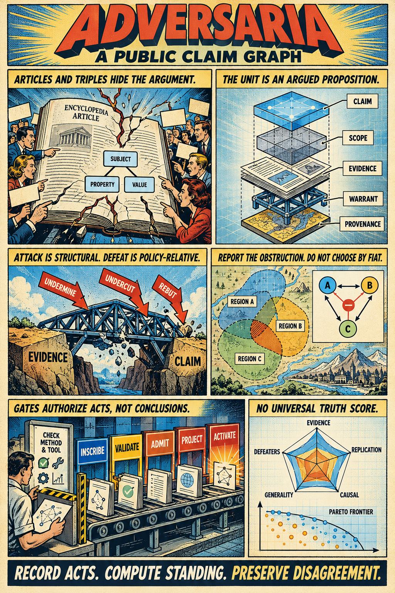
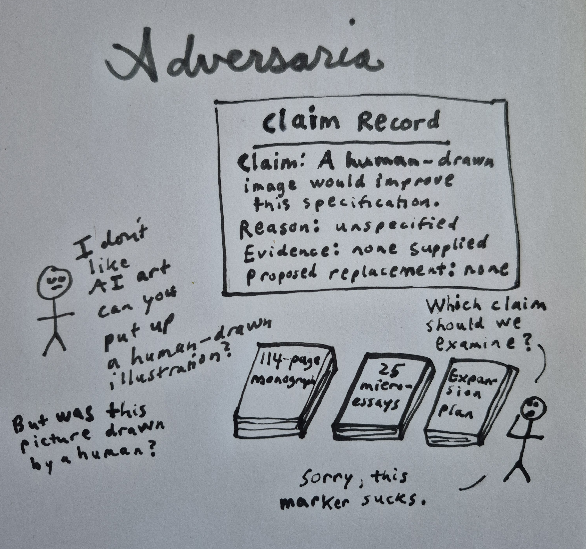
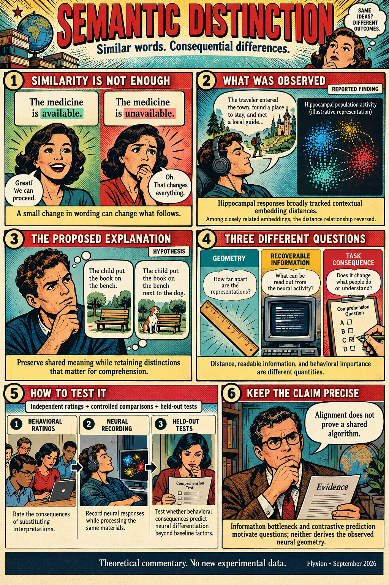
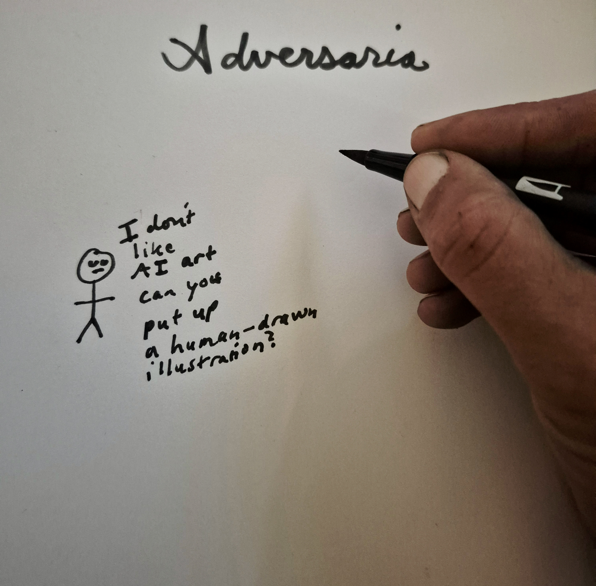

[Adversaria: A Public Claim Graph](https://standardgalactic.github.io/adversaria/adversaria-monograph.pdf)

[Semantic Distinction](https://standardgalactic.github.io/adversaria/semantic-distinction.pdf)

[Unfinishedness as Interface](https://standardgalactic.github.io/adversaria/working/out/unfinishedness-monograph-outline.pdf) — *In Progress*

<!--

-->

[The Unit of Knowledge](https://standardgalactic.github.io/adversaria/01-unit-of-knowledge.pdf)

[Routing Is Not Adjudication](https://standardgalactic.github.io/adversaria/02-routing-is-not-adjudication.pdf)

[Standing Without Scores](https://standardgalactic.github.io/adversaria/03-standing-without-scores.pdf)

[Null Results as Claims](https://standardgalactic.github.io/adversaria/04-null-results-as-claims.pdf)

[A Contested Effect](https://standardgalactic.github.io/adversaria/05-a-contested-effect.pdf)

[Three Pages and One Name](https://standardgalactic.github.io/adversaria/06-three-pages-and-one-name.pdf)

[Signed Identifications](https://standardgalactic.github.io/adversaria/07-signed-identifications.pdf)

[No Scalar, No Problem](https://standardgalactic.github.io/adversaria/08-no-scalar-no-problem.pdf)

[Replay and Anchors](https://standardgalactic.github.io/adversaria/09-replay-and-anchors.pdf)

[Disagreement Has Four Causes](https://standardgalactic.github.io/adversaria/10-disagreement-has-four-causes.pdf)

[Inscription and Authority](https://standardgalactic.github.io/adversaria/11-inscription-and-authority.pdf)

[One Claim, Five Encyclopedias](https://standardgalactic.github.io/adversaria/12-one-claim-five-encyclopedias.pdf)

[Mapping Two Ontologies](https://standardgalactic.github.io/adversaria/13-mapping-two-ontologies.pdf)

[Labeling Semantics Compared](https://standardgalactic.github.io/adversaria/14-labeling-semantics-compared.pdf)

[A Categorical Reading of Scope and Warrant](https://standardgalactic.github.io/adversaria/15-categorical-reading-of-scope-and-warrant.pdf)

[Information on Argument Graphs](https://standardgalactic.github.io/adversaria/16-information-on-argument-graphs.pdf)

[A Figure Across Three Traditions](https://standardgalactic.github.io/adversaria/17-a-figure-across-three-traditions-protocol.pdf)

[Dialogue on the Unit](https://standardgalactic.github.io/adversaria/18-dialogue-on-the-unit.pdf)

[Reader's Guide to a Claim Page](https://standardgalactic.github.io/adversaria/19-readers-guide-to-a-claim-page.pdf)

[Adversaria in Forty Frames](https://standardgalactic.github.io/adversaria/20-adversaria-in-forty-frames.pdf)

[Programmed Text on Argued Claims](https://standardgalactic.github.io/adversaria/21-programmed-text-on-argued-claims.pdf)

[The Consensus Engine](https://standardgalactic.github.io/adversaria/22-the-consensus-engine.pdf)

[Reversibility and Standing](https://standardgalactic.github.io/adversaria/23-reversibility-and-standing.pdf)

[Transport and Gluing](https://standardgalactic.github.io/adversaria/24-transport-and-gluing.pdf)

[Ledger and Recoverable Distinction](https://standardgalactic.github.io/adversaria/25-ledger-and-recoverable-distinction.pdf)
<!-- 

-->

[Spelled by Ear](https://standardgalactic.github.io/adversaria/spelled-by-ear.pdf)

  

